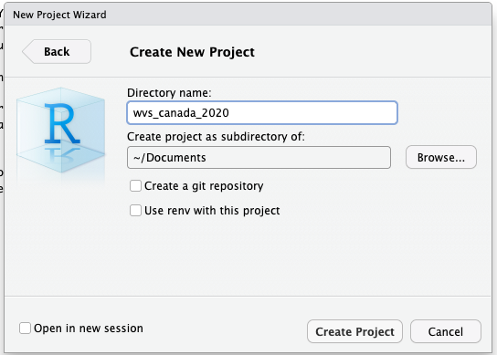

# Getting Started

We're now going to put some of these functions and operations into practice, and use them to explore our World Values Survey dataset.  

## Creating a project

Start by creating a new project. To do this, navigate to **File** and select **New Project**. From there, you will be given the option to create a project from a new or existing directory. Select **New Directory** and then **New Project**. 

You will then be able to give your new project a directory name; I'm going to name mine *wvs_canada_2020* since we'll be working with data from the 2020 Canada World Values Survey. You also have the option of creating the project as a subdirectory of another directory. I am going to create my project as a subdirectory of my `~/Documents` folder, but you can put yours where you like, or even leave that line blank (in which case your project will be saved in the root directory).

<figure markdown="span">
    {width=800}
    <figcaption>You can determine the name and location of your new project</figcaption>
</figure>

## Setting a working directory

It is always a good idea to set up an organized working directory. The working directory refers to the location on your computer where R will be reading and writing files. 

We're going to set up a fairly simple organization scheme, with separate file folders for:

- `data/` to store your raw data and intermediate datasets. For the sake of transparency and provenance, you should always keep a copy of your raw data accessible and do as much of your data cleanup and preprocessing programmatically (i.e., with scripts, rather than manually) as possible.
- `data_output/` to store modified data separtely from the original datasets.
- `fig_output/` to store any graphics we generate.
- `scripts/` to store our R scripts.

To create these four folders, run the following code:

```R
dir.create('data')
dir.create('data_output')
dir.create('fig_output')
dir.create('scripts')
```

!!!note "Note"
    You can check your working directory by running the command `getwd()`. If you are not where you'd like to be working, you can set your working directory by running the command `setwd('my/path')` where 'my/path' is the filepath to your desired directory. Try running `getwd()`. Is the output what you expected?

## Importing data

Now that we have our working directory set up, we can import our [wvs2020_subset.csv](./content/data/wvs_subset.csv) data. 

There are two ways to import data. The simplest way is to navigate to the **Import Dataset** dropdown menu in the toolbar of the **Environment** tab. From there, select the appropriate source (in this case, **From Text(base)...**). That will open a pop up window where you can navigate to, and select, your data. 

Alternatively, you can run code to import the data. Run the code below, after updating the filepath with one that locates the data on your computer.

```R
wvs_data <- read.csv("./Downloads/wvs_subset.csv")
```
!!!note "Important!"
    I use a macbook, so the filepaths here are formatted for mac. If you are using Windows, you will need to update the filepaths as appropriate. In Windows, filepaths generally start with "C:/" 

Now that our data is loaded in R, we will want to save it. To do so, run the following line of code: 
```R
write.csv(wvs_data,"./data/original_wvs2020_data.csv")
```
If you want to get a closer look at your data, you can either double click it in the environment pain, or run the command `view(wvs_data)`. There are also several functions you can use to inspect your data; we'll cover those next. 
