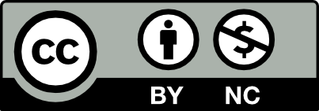

# Session 1: Intro to R & RStudio

Welcome to this two-part introductory workshop on using R and RStudio on the Digital Research Alliance of Canada's high-performance clusters. In this first workshop, we will cover the basics of coding in R, and will become familiar with using RStudio. We will cover creating objects, importing and working with data, using the basic libraries, and performing simple operations.

This session is suitable for beginners with no prior knowledge of R. There are no prerequisite coding skills. While the examples and data used will be aimed at the Humanities and Social Sciences community, the session is open to anyone and everyone interested in learning about R.

## Learning outcomes 

1. Learn to use RStudio
2. Become familiar with the basic syntax and concepts of R
3. Be able to create projects and organized working directories
4. Become familiar with popular R packages, including ‘tidyverse’ and ‘ggplot2’
5. Be able to conduct basic data analysis and visualisations

## Before we start

You will need to have R and RStudio downloaded on your computer before we start. Click [here to download R](https://muug.ca/mirror/cran/), and [here to download RStudio](https://posit.co/download/rstudio-desktop/). 

We will be using a subset data from the [World Values Survey](https://www.worldvaluessurvey.org/WVSDocumentationWV7.jsp) wave 7 survey of Canada. You can download the data [here](./content/data/wvs_subset.csv) and view the codebook for our data subset [here](./content/codebook.xlsx).

I'd encourage you to follow along on your own in RStudio, but if you get stuck, or want to check something, you can download my script [here](./content/day1_script.R). 

!!!note ""
    Instructor: Maria Sigridur Finnsdottir, PhD. 
    {width=100}