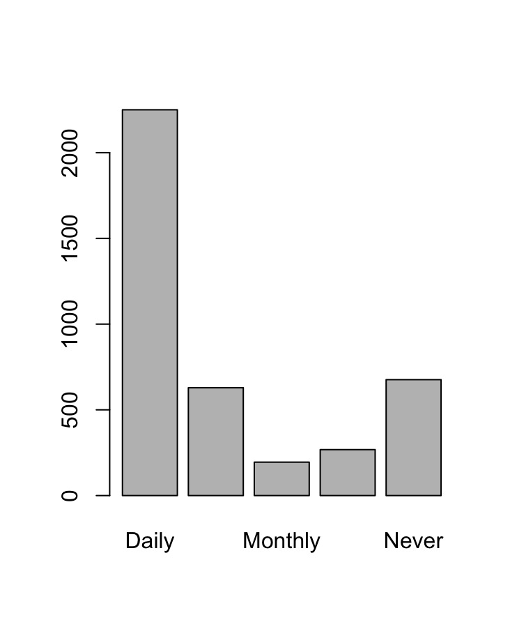

# Inspecting, Subsetting, and Examining Data

Now that our data is uploaded into R, we can start to examine it. A viewer tab will likely have opened when you imported your data (in the Source Editor), but if not, you can run the command `View(wvs_data)` to see it. Remember, R is case sensitive, so be sure to write **View** not **view**. 

Our dataset includes 23 variables. Try running `names(wvs_data)` to view a list of the variable names. You should see a list containing the following:

- **A_YEAR** the year of data collection (2020 in every case here)
- **N_REGION_ISO** the respondent's region (province)
- **Q1** Important in life: Family
- **Q46** Feeling of happiness
- **Q47** State of health (subjective)
- **Q49** Satisfaction with your life
- **Q50** Satisfaction with financial situation of household
- **Q56** Standard of living comparing with your parents
- **Q57** Most people can be trusted
- **Q75** Confidence: Universities
- **Q95** Active/inactive memberships: Sport or recreational organization...
- **Q178** Justifiable: Avoiding a fare on public transport
- **Q199** Interest in politics
- **Q201** Information source: Daily newspaper
- **Q207** Information source: Social media
- **Q260** Sex (respondents are asked to pick the one that aligns best with their identity)
- **Q261** Year of birth 
- **Q263** Respondent immigrant
- **Q273** Marital status
- **Q275** Highest educational level
- **Q279** Employment status
- **Q284** Sector of employment
- **Q287** Social class (subjective)

You can view the full codebook on the [World Values Survey website](https://www.worldvaluessurvey.org/WVSDocumentationWV7.jsp). 

## Inspecting data

`names()` is only one of a number of functions that we can call to inspect our data frame. Let's try a few more: 
```R
dim(wvs_data) #will return a vector with the dimensions of the table (number of rows, and number of columns)

str(wvs_data) #will return information on the structure of the object (a data frame in this case) and on the class, length, and content of each column

head(wvs_data) #will show the first six rows of the data frame
tail(wvs_data) #will show the last six rows of the data frame
```
## Subsetting data frames
R allows us to extract specific information from data frames, if we are only interested in some subset of the data. To access this specific data, you need to specify the indices (the location) of the data. This is done by  listing the row number of the data point  followed by the column number inside square brackets. Try running the following code: 
```R
wvs_data[2,2]
```
Here, we have extracted the data found in the second row and second column of the wvs_data data frame. You should get the following output: 

!!!note "Output"
    ```R
    [1] "CA-ON Ontario"
    ```
There are a number of ways to customize your subset. For one, you can subset out a range of rows and/or columns by using `:`, which creates a numeric vector of ordered integers. You can also subset all rows or columns by leaving the row or column position in the square brackets blank. Finally, by using the `-` sign, you can exclude a row or column. Let's give it a try! Run the following code and note your output.
```R
wvs_data[2,1:5]
wvs_data[ ,2]
wvs_data[2,-1]
```
!!!note "Output"

    1. You should get the data from columns one through five for row two (year, region, importance of family, feeling of happiness, and subjective state of health)
    2. This will give you the values from column 2 for every row in the data frame
    3. This will give you the data from row two with the exception of column one (the year of data collection)

**Practice.** It might also be useful to turn our subsets into their own objects. To do this, we need to assign the subset to another object. Let's practice this by creating a subset of just the first 100 rows of the dataframe. Name your new data frame "wvs_first100."

???note "Solution"
    ```R
    wvs_first100 <- wvs_data[1:100, ]
    ```
Before we move on, let's practice saving data by saving our data frame "wvs_first100" to the data outputs folder. You may need to modify the file path in the function if you're using a PC.  
```R
write.csv(wvs_first100, "./data_output/wvs_canada_first100.csv")
``

## Using factors

Factors are a type of data structure designed to deal with categorical data. Factors are particularly useful when creating plots or doing simple statistical analysis on categorical/textual data. 

Factors store categorical data as integers associated with labels. These labels can be ordered (ordinal) or unordered (nominal). They are ordinal when the order of the integers matters (like in a likert scale), and nominal when it does not (like in a list of colours).

While factors look (and often behave) like character vectors, they are actually treated as integer vectors by R. So you need to be very careful when treating them as strings.

Once created, factors can only contain a pre-defined set of values, known as levels. 

Let's use factors to better understand the distribution of public and private sector employment in our dataset. First, we need to create a factor from the variable Q284. As the order of levels does not matter in this case, we can create an unordered, or nominal, factor. 

```R
#Start by creating a factor called emp_sector from the Q284 variable in our data frame. Remember that we use the $ symbol to locate a variable inside a data frame
emp_sector <- factor(wvs_data$Q284)

#Next, use the levels() function to print out the levels of the factor. You should see 4 different options for employment sector. 
levels(emp_sector)
```

Now, let's say we're really only interested in whether respondents are employed in the public sector or not. We can combine the two private sector levels into one and rename it. We can do both of these actions using the `fct_recode` function. 

```R
#Let's start by recoding 'Private non-profit organization' as 'Private'
emp_sector <- fct_recode(emp_sector, Private="Private non-profit organization")

#Now we can combine 'Private business or industry into the 'Private' level
emp_sector <- fct_recode(emp_sector, Private="Private business or industry")
```
Run the `levels()` function again - what changes do you see? 

!!!note "Note"
    You'll notice that in both cases we are assigning the change to the same variable. If we don't assign the change we're making to an object then when we run it, it will just print to console and won't be saved.

By default, R always sorts levels in alphabetical order. This can be an issue when we're working with a variable where the order of values matters, like in a scale. Let's practice making an ordered factor with the variable Q207, which asked respondents about how often they use social media to read the news. 

To create an ordered factor, we need to add two arguments to the `factor()` function that we used above: an `ordered` argument, and a `levels` one. Let's assign this new factor to an object called `sm_news`.

```R
sm_news <- factor(wvs_data$Q207, 
                  ordered=TRUE,
                  levels = c("Daily","Weekly","Monthly","Less than monthly","Never"))
```
Now if we run the levels() command again, we should see the levels arranged properly in order of frequency. 

Finally, let's plot out the distribution of frequency of social media use for news. To do this, run the `plot()` function on your `sm_news` factor. You should see a plot appear in the bottom right pane.  

<figure markdown="span">
    {width=800}
    <figcaption>Simple plot of the frequency of social media use for news.</figcaption>
</figure>

We can save the plot by navigating to the **Export** button on the **Plots** pane. From there, save your plot as a jpeg in the `figs_output/` folder. There are other ways to save graphs which we will cover later. 