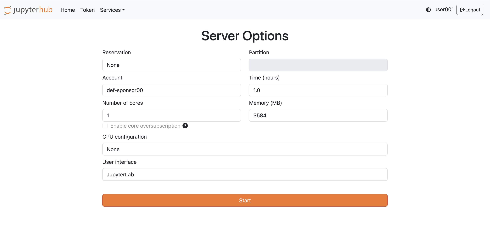
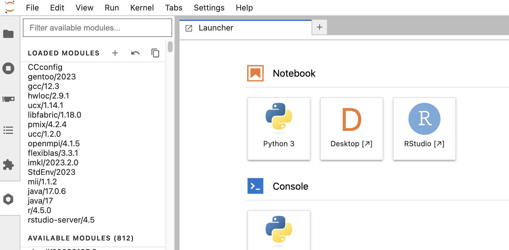
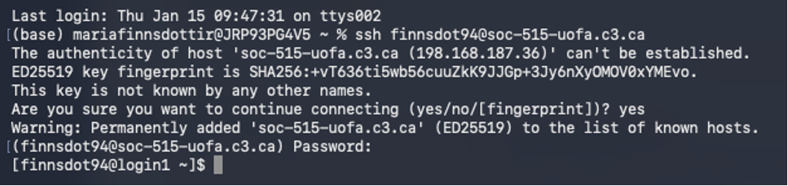
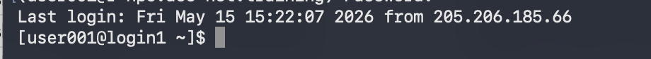

# Using R on HPC. 

There are two ways to use R on the Alliance's HPC clusters. The first, and easiest, way is to access RStudio through JupyterHub in your browser window. This is a great way to test code, run visualizations, and do other light work, but bigger jobs should be submitted through the batch job system. 

## Accessing RStudio in your browser

To access RStudio in your browser, start by locating the web address of the cluster you want to log in to (you can find the various URLs in the [Alliance documentation](https://docs.alliancecan.ca/wiki/National_systems#Compute_clusters)). For example, if we want to use RStudio on Fir, we need to navigate to `https://jupyterhub.fir.alliancecan.ca/`. 

From there, you'll need to log in with your Alliance credentials and then start a server session. On the JupyterHub landing page, you'll have options for how long you want your session to last, how many cores you need, and how much memory you want. You will also be able to specify the GPU configuration and the user interface. 

!!!note Note
    Because these interactive sessions are meant to be for light work and debugging, you are more limited in the amount of compute and memory you can ask for than you would be when submitting jobs through the shell (which we will cover later on). 

<figure markdown="span">
    {width=600}
    <figcaption></figcaption>
</figure>

!!!note Note
    For today's session, we'll be using a training cluster spun up specifically for this workshop. You will be provided the URL and log in information in the session.

After you've started your session, if this is the first time you've used RStudio on this cluster, you'll need to load your chosen RStudie and R modules. Navigate to the menu on the left side of the screen, and click on the hexagon icon. From there, you can scroll down through the available modules and select `r/4.5.0` and `rstudio-server/4.5`. Finally, click on the RStudio button that should now have appeared under the Notebook heading. 

<figure markdown="span">
    {width=600}
    <figcaption></figcaption>
</figure>

By default, there are only a small number of packages installed in RStudio on the clusters. The first time you log into RStudio on a cluster, you will need to install the packages you use through the shell/terminal ([see more here](https://docs.alliancecan.ca/wiki/R#Installing_R_packages)). As the clusters are not hooked up to the internet, you cannot do this within RStudio. Instead, you  will need to log into the cluster through the shell, launch an R session there, and install your packages. 

## Accessing R through the shell 

The first step to access R on the Alliance's HPC clusters is to securely log in (using `ssh`) to your chosen cluster through the shell. Depending on your operating system, you'll either use the Terminal (on Linux and Mac) or the Command Prompt (on Windows) application to access the shell. 

### Logging in using ssh 

In order to log into one of the Alliance's clusters, we need to use a secure shell remote login client; the command for this is `ssh`. The basic structure of the command is: 

```shell
ssh username@remote_system_url
```

The arguments in this command are (1) the username you've been assigned in the remote system, and (2) the URL/address of the system you are trying to connect to.

To log in to an Alliance cluster, you will use your [CCDB](https://www.alliancecan.ca/en/our-services/advanced-research-computing/account-management/apply-account) username and the [address of one of the clusters](https://docs.alliancecan.ca/wiki/National_systems#Compute_clusters). For example, if user000 were to log in to the Fir cluster, they would use the following ssh command: 

```shell 
ssh user000@fir.alliancecan.ca
```

For step-by-step video on logging into the Alliance's clusters, [click here](https://www.youtube.com/watch?v=MAyLpC8zyQE). 

The first time you log in to a system, you will get a warning message with a fingerprint challenge alerting you that your computer doesn't recognize the key fingerprint of the remote system. For example, here is a fingerprint challenge I encountered logging into a workshop cluster for the first time: 

<figure markdown="span">
    {width=600}
    <figcaption> </figcaption>
</figure>

!!! note "Reasons you might see a fingerprint challenge when logging in:" 

    1. This is your first connection with the specific cluster.
    2. You have removed the cluster address entry from your computer’s ~/.ssh/known_hosts file. This file contains the key fingerprints of remote systems you have previously connected to. When you start an SSH session, ssh checks the key fingerprint in this file to the one presented during an SSH connection attempt. If they are different, it will ask you to confirm the connection attempt.
    3. The servers ssh configurations have been updated, causing the key fingerprint to change. Before confirming the connection, contact the server administrators to confirm the update before continuing. The Alliance cluster key fingerprints are available for comparison on the technical documentation wiki [SSH Security Improvements](https://docs.alliancecan.ca/wiki/SSH_security_improvements#SSH_host_key_fingerprints) page.
    4. A bad actor has created an on-path cyberattack to capture your username and password for future use.

Type `yes` to continue connecting to the remote system only if reasons 1, 2, or 3 explain why you are seeing the challenge message. 


When you type your password in, you will **not see anything appear on the screen**: your password will not be printed, nor will you see any key stroke indicators like dots or asterisks. This means you need to be extra careful typing your password - entering an incorrect password more than a few times will cause the system to block your connection attempts for some period of time before you can try again. 

!!!note "Using the Alliance clusters."
    The Alliance clusters use [multifactor authentication](https://docs.alliancecan.ca/wiki/Multifactor_authentication) for logging in, meaning that you will need to have it set up before trying to connect to a cluster.

### Working in the remote system shell

Once you are logged in, you will notice that the command prompt in your shell has changed, indicating that you are now in a different system. Your prompt will display your username on this system, the system's name, and your current working directory, followed by a prompt symbol.

For example, when I log in to this session's training cluster, in my prompt line I see that my username is `user001`, that I am logged in to the `login1` node on the remote system, and that I am in my home directory (represented by the `~`):

<figure markdown="span">
    {width=600}
    <figcaption></figcaption>
</figure>

Type the command `ls` to list the objects in your home directory. You should by default have a `project` and a `scratch` directory. If you have already used RStudio on this cluster through your browser, you shoudl also see a `R` directory. Navigate into that directory using the following command:

```shell
cd R
```

There are two ways to launch an R session on the cluster. One option is to just type `R` and hit enter, and then select the version of R that you want to use from the list that appears. 

The neater way (provided you know which version you want to use) is to load the version of R and then launch it, like so: 

```shell
module load r/4.5.0
R
```

Once that is loaded up, you can work in R just like you would locally. Importantly, you'll be able to install the required packages the normal way, by calling `install.packages()`. For this workshop, you'll need to install `tidyverse`, `broom`, `coefplot`, and `naniar`:

```R
install.packages(c('tidyverse', 'broom', 'coefplot', 'naniar'))
```

The first time you install a package through the shell, R will ask whether you want to create a personal library in your home directory - answer `yes`. You will then have to select a CRAN mirror to use (I generally use Canada (ON1) but you can pick whichever).

Once the package is installed (which may take several minutes) you'll need to restart your RStudio session in JupyterHub. Once you've done that, you should see `tidyverse` in your list of available packages in the packages pane. 

!!!note Note
    The training cluster we're using in this session has been set up to already have our required packages downloaded in a shared directory (thank you to the ACENET team!). To access these packages, we will be including this command setting our library path in our R scripts:

    ```R
    .libPaths("/project/def-sponsor00/common/lib/R")
    ```