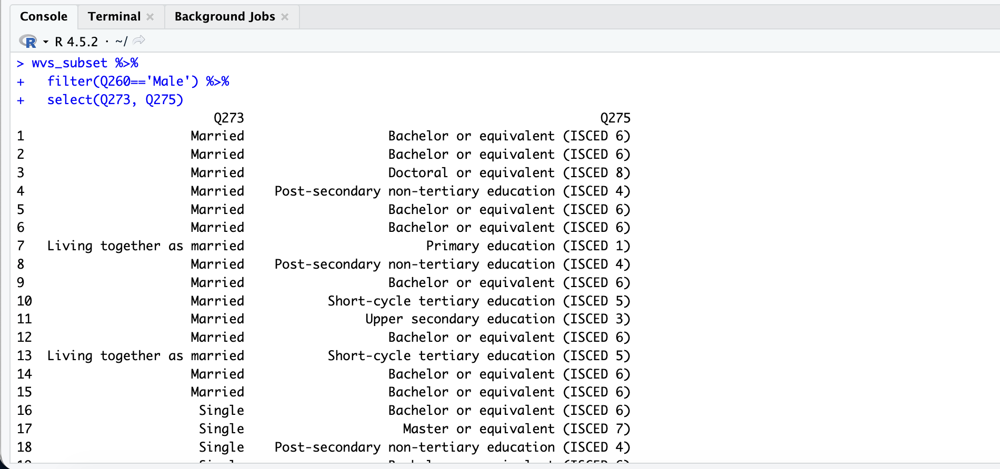
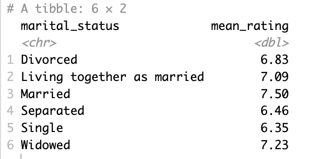

# Data Wrangling with dplyr

`dplyr` is another important package in R that makes it easy to extract and summarize insights from tabular data. Luckily, `dplyr` is included in `tidyverse` and was loaded into R's memory when we called `library(tidyverse)`.

In this section, we're going to cover just the most common `dplyr` functions:

- `select()`: subset columns
- `filter()`: subset rows on conditions
- `mutate()`: create new columns by using information from other columns
- `group_by()` and `summarize()`: create summary statistics on grouped data
- `arrange()`: sort results
- `count()`: count discrete values

## Selecting & filtering 

Selecting and filtering are both techniques to focus in on some chosen data in a data frame. `select()` is used to select specific columns of a data frame. When we call `select()`, the first argument in the parentheses will be the data frame, followed by the columns to keep, separated by commas. Let's try selecting respondent sex, birth year, immigrant status, and marital status. 
```R
select(wvs_data, sex, birth_year, immigrant, marital_status)
```
Since these columns are adjacent to one another in our data frame, we can get the same result by using the `:` operator.
```R
select(wvs_data, sex:marital_status)
```

Filtering, on the other hand, is used to select out rows based on conditions. To use `filter()`, you put the data frame as the first argument inside the parentheses, and the conditions as the second. For example, we can filter our data frame to include only respondents who identified as male like so:
```R
filter(wvs_data, sex=='Male')
```
Note that we used a double equals sign (==) here. The double equals sign represents a logical test of equality, testing whether the left and right values are equal. In the case of a filter, it tests whether the value of each row of left value (the variable) is equal to the right value (the desired data value). 

We can add further conditions to our filter, seperated by commas. For example, we can filter our data down to male respondents born in or after 1980 by running the following:

```R
filter(wvs_data, sex=='Male',
                birth_year>=1980)
```
**Practice.** Using the filter function, find how many female respondents use social media for news on a daily basis. 

???note "Solution"
    ```R
    # You should filter the data by sex and social media use for news
    filter(wvs_data,
            sex=='Female',
            social_media=='Daily')
    ```

## Pipes

Pipes are a way to do more complicated operations in R, such as selecting and filtering at the same time. Pipes let you take the output of one function and send it directly to the next, which is useful when you need to do many things to the same dataset. 

There are two Pipes in R: the magrittr pipe (installed automatically with `dplyr`) and the native pipe. In this workshop, we will be using the margrittr pipe (which is usually the default one). Both the pipes are, by and large, function similarly with a few differences (For more information, check [the tidyverse site](https://www.tidyverse.org/blog/2023/04/base-vs-magrittr-pipe/)). The choice of which pipe to be used can be changed in the Global settings in R studio.

Pipes are represented by `%>%` in R. Rather than type it out every time, you can use the following keyboard shortcut: ++ctrl+shift+m++ (on PC) or ++cmd+shift+m++ (on mac). 

Let's start by using pipes to view information about the educational attainment and marital statuses of the male respondents in our dataset. To do this, we'll start by filtering on sex and then selecting marital status and education.

```R
wvs_data %>%
    filter(sex=='Male') %>%
    select(marital_status, education)
```
Running that command should print the following to your console: 
<figure markdown="span">
    {width=800}
    <figcaption></figcaption>
</figure>

In the above code, we use the pipe to send the dataset first through `filter()` to keep rows where the respondent's sex is 'male' and then through `select()` to keep only the marital status and educational attainment columns. Since `%>%` takes the object on its left and passes it as the first argument to the function on its right, we don’t need to explicitly include the dataframe as an argument to the `filter()` and `select()` functions any more.

The dplyr functions by themselves are somewhat simple, but by combining them into linear workflows with pipes, we can accomplish more complex data wrangling operations.

If we want to create a new object with this smaller, filtered, version of the data, we can assign it a new name:
```R
wvs_men <- wvs_data %>%
    filter(sex=='Male') %>%
    select(marital_status, education)
```
**Practice.** Using pipes, subset the world values survey data to include only married respondents and to retain only information on their birth year, province of residence, and employment status (in that order). Create a new object with the data, and assign it the name "married_data."

???note "Solution"
    ```R
    #Your code should look like this: 

    married_data <- wvs_data %>% 
        filter(marital_status=="Married") %>% 
        select(birth_year, province, employed)

    #This will produce a data frame object with 3 variables and 220 observations. You should see this data frame in the Environment pane.
    ```

## Mutate
Frequently you’ll want to create new columns based on the values in existing columns, for example to do unit conversions, or to find the ratio of values in two columns. For this we’ll use mutate().

For example, you might be interested in the age of the respondents in our dataset at the time of data collection. For this, we would need to create a new variable in our data frame that subtracts the birth year in each row for the year of data collection. 

```R
wvs_data %>% 
  mutate(age = (year-birth_year))
```

**Practice.** How would we change the code above to save our new `age` variable? 

???note "Solution"
    To add this new variable to our data frame, we need to assign the mutated data to an object. It's good practice to create a new data frame in cases like this, leaving the original data intact. So, you could do something like this:
    ```R
    wvs_data2 <- wvs_data %>% 
        mutate(age = (year-birth_year))
    ```

We can also combine the mutate function with a `recode` function to create new variables with values based on an old one. Let's try creating a dummy variable for `female` using our `sex` variable. We'll assign this new variable to the same modified data frame as above.

To do this, we need to pipe a mutate function into the data frame, and then name our new variable and define it as a recode function on sex. Notice that we use the single equals sign here (unlike when we filter and select) - remember, the single equals sign functions as an assignment operator. 

```R
wvs_data2 <- wvs_data2 %>% 
  mutate(female = recode(sex,
                         'Male'=0,
                         'Female'=1))
```

## Split-apply-combine
Many data analysis tasks can be approached using the split-apply-combine paradigm: split the data into groups, apply some analysis to each group, and then combine the results. `dplyr` makes this very easy through the use of the `group_by()` function.

### The summarize() function
`group_by()` is often used together with `summarize()`, which collapses each group into a single-row summary of that group. 

`group_by()` takes as arguments the column names that contain the categorical variables for which you want to calculate the summary statistics. It is best practices to end your `group_by()` operations with the `ungroup()` function (while it won't matter for our purposes here, it can mess up later calculations if you don't ungroup). 

So, if we wanted to calculate the average life satisfaction of respondents with different marital statuses, we could do the following:
```R
wvs_data2 %>%
    group_by(marital_status) %>%
    summarize(mean_satisfaction = mean(life_satis))%>%
    ungroup()
```
Running this code should print the following output to your console: 
<figure markdown="span">
    {width=800}
    <figcaption></figcaption>
</figure>

Notice that we're now working with the modified version of our data, the one with the age variable that we created. 

We also have the option of specifying the sort order of our data. To do this, we need to add a `arrange()` function to the end of our pipeline. So, if we wanted to sort the marital status groups by their average life satisfaction, we could do this: 
```R
wvs_data2 %>%
    group_by(marital_status) %>%
    summarize(mean_satisfaction = mean(life_satis))%>%
    arrange(mean_satisfaction)%>%
    ungroup()
```

We can further customize our sorting to be from highest to lowest by adding the `desc()` function. The `desc()` function is nested inside the `arrange()` function like so `arrange(desc(x))`. 

**Practice.** Use the `arrange()` and `desc()` functions to modify the above code so that our output is arranged from highest mean life satisfaction to lowest. Assign the output to a new object called "ave_life_satis."

???note "Solution"
    ```R
    ave_life_satis <- wvs_data2 %>%
        group_by(marital_status) %>%
        summarize(mean_satisfaction = mean(life_satis))%>%
        arrange(desc(mean_satisfaction))%>%
        ungroup()
    ```

## Counting

The `count()` function in `dplyr` lets us count (intuitive, I know) observations. Importantly, we can include arguments that allow us to count observations based on different factors or combinations or factors. 

To use the `count()` function to count the values in a column within a data frame, we need to pipe it from the data frame object. 

For example, let's use the `count()` function to count the number of respondents with university degrees.  
```R
wvs_data2 %>% 
  count(education)
```

How many respondents report having completed university degrees? What is the most common degree among our respondents? We can add a `sort` argument to our function to make it easier to tell. 

```R
wvs_data2 %>% 
  count(education, sort=TRUE)
```